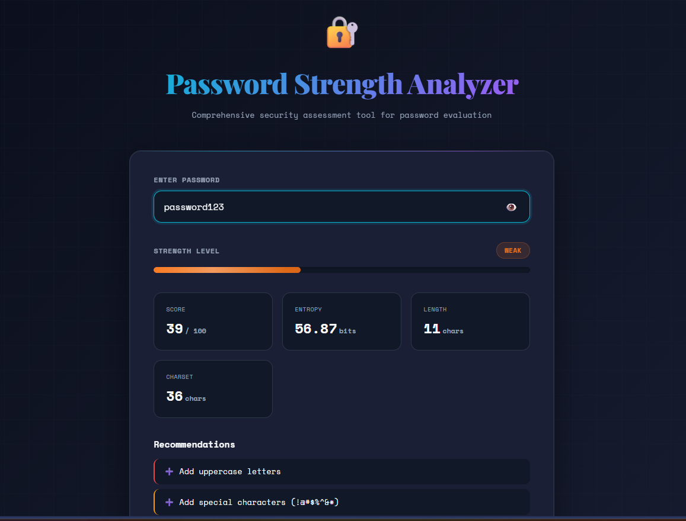
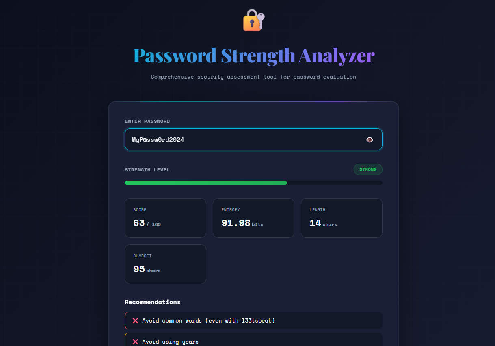
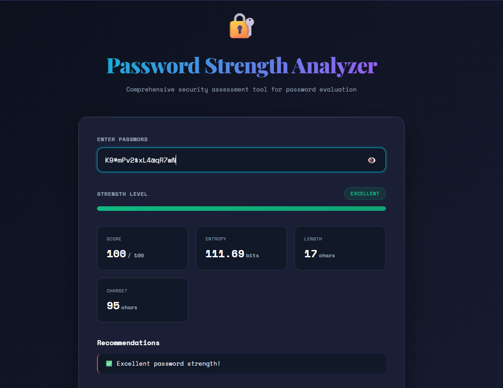

# SCT_CS_3 — Password Strength Analyzer 🔐💪
A comprehensive password security assessment tool with real-time analysis and entropy-based scoring, developed as **Task 3** of the Cyber Security Internship at **SkillCraft Technology**. The tool provides detailed feedback on password strength using multiple security heuristics.

---

## Overview
This project demonstrates advanced password strength evaluation through multi-factor analysis. By examining length, character variety, entropy, common patterns, and dictionary matches, the tool provides actionable feedback to help users create stronger passwords. The system includes both an interactive web interface and a powerful command-line tool for integration into security workflows.

---

## Getting Started

### Prerequisites
- Python 3.7 or higher
- Modern web browser (Chrome, Firefox, Safari, Edge)
- No additional Python packages required (uses only standard library)

### Installation
No installation required! The project is ready to use out of the box.

### Running the Application

#### Web Interface (Recommended)
Simply open `password_analyzer.html` in any modern web browser:
```bash
# Linux/macOS
open password_analyzer.html

# Windows
start password_analyzer.html
```

#### Command-Line Tool
```bash
python password_analyzer.py --password <your_password> [options]
```

The program accepts the following arguments:
1. **--password** (`-p`) — password to evaluate (required)
2. **--verbose** (`-v`) — show detailed pattern analysis (optional)

### Sample Run

**Basic Analysis:**
```bash
python password_analyzer.py -p "MyP@ssw0rd123"
```
**Output:**
```
============================================================
PASSWORD STRENGTH ANALYSIS
============================================================

Score:               52/100
Strength Level:      Moderate
Entropy:             59.54 bits
Character Pool:      69 characters

                CRACK TIME ESTIMATES
------------------------------------------------------------
  Offline Fast              3.5 years
  Offline Slow              3546.3 years
  Online Throttled          1.8 centuries
  Online Strict             1806.5 centuries

                  RECOMMENDATIONS
------------------------------------------------------------
  ❌ Avoid using years
  ❌ Avoid common words (even with l33tspeak)

============================================================
```

**Verbose Analysis:**
```bash
python password_analyzer.py -p "password123" -v
```
**Output:**
```
============================================================
PASSWORD STRENGTH ANALYSIS
============================================================

Score:               8/100
Strength Level:      Very Weak
Entropy:             39.53 bits
Character Pool:      36 characters

                CRACK TIME ESTIMATES
------------------------------------------------------------
  Offline Fast              < 1 second
  Offline Slow              0.3 seconds
  Online Throttled          2.7 minutes
  Online Strict             4.6 hours

                  RECOMMENDATIONS
------------------------------------------------------------
  ❌ Use at least 8 characters (12+ recommended)
  ➕ Add uppercase letters
  ➕ Add special characters (!@#$%^&*)
  ❌ Avoid sequences (abc, 123, qwerty)
  ❌ Avoid common words (even with l33tspeak)
  ❌ Avoid common number sequences

                  PATTERNS DETECTED
------------------------------------------------------------
  Sequential: 1
  Dictionary Hits: 2

============================================================
```

---

## Features

| Feature | Description |
|---|---|
| **Real-time Analysis** | Instant password strength feedback in web interface |
| **Entropy Calculation** | Mathematical measurement of password randomness |
| **Pattern Detection** | Identifies sequences, keyboard patterns, and repetitions |
| **Dictionary Checking** | Detects common words with leetspeak normalization |
| **Multi-Scenario Estimates** | Crack time calculations for 4 different attack scenarios |
| **Character Variety Check** | Evaluates use of uppercase, lowercase, digits, symbols |
| **Interactive Web UI** | Modern, responsive interface with visual strength meter |
| **CLI Tool** | Command-line interface for scripting and automation |
| **Detailed Feedback** | Actionable recommendations for password improvement |
| **Privacy-First** | All processing done locally, no data transmission |

---

## How It Works

The `password_analyzer` uses a sophisticated multi-factor scoring system:

### Scoring Algorithm (0-100 points)
- **Length Scoring (0-35 pts)**: Rewards longer passwords
  - < 6 chars: 0 pts | 6-7 chars: 10 pts | 8-11 chars: 20 pts | 12-15 chars: 30 pts | 16+ chars: 35 pts
- **Character Variety (0-30 pts)**: Evaluates character type diversity
  - Checks for lowercase, uppercase, digits, and special characters
- **Entropy Bonus (0-20 pts)**: Based on theoretical password complexity
  - Formula: `length × log₂(charset_size)`
- **Uniqueness Bonus (0-15 pts)**: Rewards high ratio of unique characters
  - > 80% unique: 15 pts | > 60%: 10 pts | > 40%: 5 pts

### Penalty System (Deductions)
- **Sequential Patterns**: abc, 123, xyz (−8 pts each)
- **Keyboard Patterns**: qwerty, asdf (−10 pts each)
- **Repeated Characters**: aaa, 111 (−10 pts each)
- **Repeated Patterns**: abcabc, 123123 (−8 pts each)
- **Dictionary Words**: Including leetspeak variations (−15 pts each)
- **Year Patterns**: 1990-2030 (−10 pts)

### Crack Time Estimation
Calculates expected time to crack under different scenarios:
1. **Offline (GPU Cluster)**: ~1 trillion guesses/sec
2. **Offline (Standard GPU)**: ~1 billion guesses/sec
3. **Online (Rate Limited)**: ~1,000 guesses/sec
4. **Online (Strict Limit)**: ~10 guesses/sec

Formula: `Time = 2^(entropy_bits - 1) / guesses_per_second`

---

## 📊 Examples

### Weak Password


**Input:** `password123`
```
Score:     39/100
Strength:  Very Weak
Entropy:   39.53 bits
Issues:    Dictionary word, sequential numbers, missing uppercase & symbols
```

---

### Moderate Password


**Input:** `MyP@ssw0rd2024`
```
Score:     63/100
Strength:  Moderate
Entropy:   72.41 bits
Issues:    Leetspeak detected, contains year pattern
```

---

### Strong Password


**Input:** `K9#mPv2$xL4@qR7wN`
```
Score:     100/100
Strength:  Excellent
Entropy:   114.38 bits
Crack Time: 5.8 million centuries (offline fast)
```

---

## Operations & Examples

### Web Interface Features

#### 1. Real-Time Strength Meter
- Visual progress bar showing password strength
- Color-coded feedback (red → orange → yellow → green)
- Instant updates as you type

#### 2. Statistics Dashboard
- Score out of 100
- Entropy in bits
- Password length
- Character set size

#### 3. Actionable Recommendations
- ✅ Positive feedback for strong passwords
- ➕ Suggestions to add character types
- ❌ Warnings about detected weaknesses
- ⚠️ Cautions for moderate issues

#### 4. Crack Time Estimates
Four attack scenario calculations:
- Offline (GPU Cluster) - Worst case
- Offline (Standard GPU) - Common threat
- Online (Rate Limited) - Throttled attacks
- Online (Strict Limit) - Best case protection

### Command-Line Examples

#### Check Single Password
```bash
python password_analyzer.py -p "Tr0ub4dor&3"
```

#### Verbose Mode (Show All Patterns)
```bash
python password_analyzer.py -p "qwerty123" -v
```

#### Compare Multiple Passwords
```bash
for pwd in "password" "P@ssw0rd1" "correct-horse-battery-staple"; do
    echo "Testing: $pwd"
    python password_analyzer.py -p "$pwd"
    echo ""
done
```

---

## Project Structure

```
SCT_CS_3/
├── password_analyzer.py      # Python CLI tool with full analysis engine
├── password_analyzer.html    # Interactive web interface
├── weak.jpg                  # Example: weak password analysis
├── moderate.jpg              # Example: moderate password analysis
├── strong.jpg                # Example: strong password analysis
├── README.md                 # Project documentation
└── CHANGELOG.md              # Version history
```

---

## Technical Details

### Web Interface
- **Framework**: Pure JavaScript with React
- **Styling**: Custom CSS with dark cyberpunk theme
- **Fonts**: Space Mono (monospace) + Playfair Display (headers)
- **Animations**: CSS keyframes for smooth transitions
- **Compatibility**: Chrome 90+, Firefox 88+, Safari 14+, Edge 90+

### Python Tool
- **Dependencies**: None (standard library only)
- **Python Version**: 3.7+
- **Architecture**: Dataclass-based metrics, modular functions
- **Output**: Formatted text with ANSI support

### Security Considerations
- **Privacy**: All processing is local (no network requests)
- **Data Handling**: Passwords never stored or logged
- **Educational Purpose**: Tool is for assessment, not actual password storage
- **Reversibility**: All operations are read-only

### Strength Levels

| Score Range | Label | Color | Security Level |
|-------------|-------|-------|----------------|
| 0-19 | Very Weak | Red (#ef4444) | Immediately crackable |
| 20-39 | Weak | Orange (#f97316) | Vulnerable to basic attacks |
| 40-59 | Moderate | Yellow (#eab308) | Minimum acceptable security |
| 60-79 | Strong | Green (#22c55e) | Good resistance to attacks |
| 80-100 | Excellent | Emerald (#10b981) | Highly secure |

---

## Password Best Practices

### ✅ DO
- Use at least 12-16 characters
- Mix uppercase, lowercase, numbers, and symbols
- Use passphrases (e.g., "correct-horse-battery-staple")
- Use unique passwords for each account
- Enable two-factor authentication (2FA)
- Use a password manager

### ❌ DON'T
- Reuse passwords across accounts
- Use personal information (names, birthdays)
- Use common words or phrases
- Use simple patterns (qwerty, 12345, abc123)
- Share passwords via insecure channels
- Use passwords shorter than 8 characters

---

## Common Patterns to Avoid

| Pattern Type | Examples | Why It's Weak |
|--------------|----------|---------------|
| **Sequential** | abc, 123, xyz | Easily guessable |
| **Keyboard** | qwerty, asdf, zxcvbnm | Well-known patterns |
| **Repeated** | aaa, 111, abcabc | Low entropy |
| **Dictionary** | password, admin, welcome | In common wordlists |
| **Leetspeak** | p@ssw0rd, h4ck3r | Trivial to crack |
| **Years** | 2024, 1990, 1999 | Predictable substitutions |
| **Common Substitutions** | @ for a, 0 for o | Standard attack dictionaries |

---

## Future Enhancements

- [ ] Zxcvbn integration for more sophisticated pattern matching
- [ ] Multi-language dictionary support
- [ ] Password generation with custom rules
- [ ] Passphrase generator based on EFF wordlist
- [ ] Hash collision checking against haveibeenpwned.com
- [ ] Export analysis reports (PDF/JSON)
- [ ] Browser extension version
- [ ] API endpoint for integration

---

## Contributing

Contributions are welcome! Here's how you can help:

1. **Report Bugs**: Open an issue with details
2. **Suggest Features**: Propose new functionality
3. **Improve Patterns**: Add detection for new weak patterns
4. **Enhance UI/UX**: Design improvements welcome
5. **Documentation**: Help improve README and code comments

---

## License

MIT License - Free for personal and commercial use

---

## Acknowledgments

- Inspired by NIST password guidelines (SP 800-63B)
- Pattern detection informed by common password research
- Crack time calculations based on industry benchmarks
- UI design influenced by modern cybersecurity tools

---

## Developed By
**RITIK KUMAR**  
Cyber Security Intern — Task 3 | [SkillCraft Technology](https://www.skillcrafttechnology.com)

---

## Disclaimer

This tool is designed for **educational and assessment purposes only**. While it provides helpful guidance on password strength, it should not be considered a definitive security audit. Always follow your organization's password policies and use established password managers for actual credential storage.

**Remember**: The strongest password is one that is both highly complex AND unique to each service!
